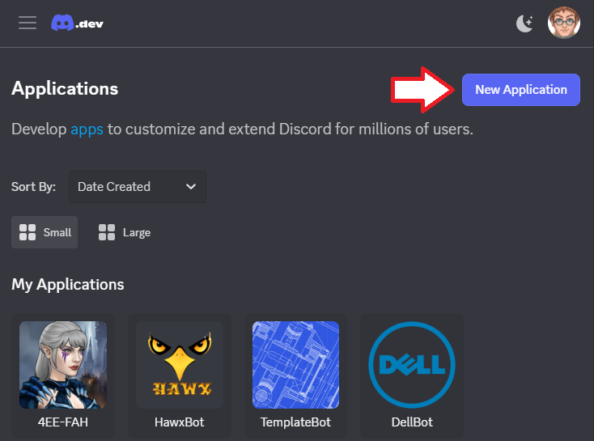
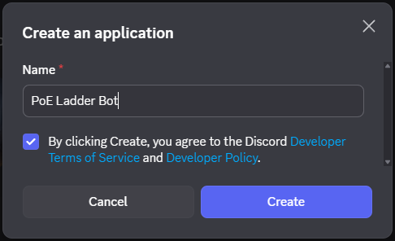
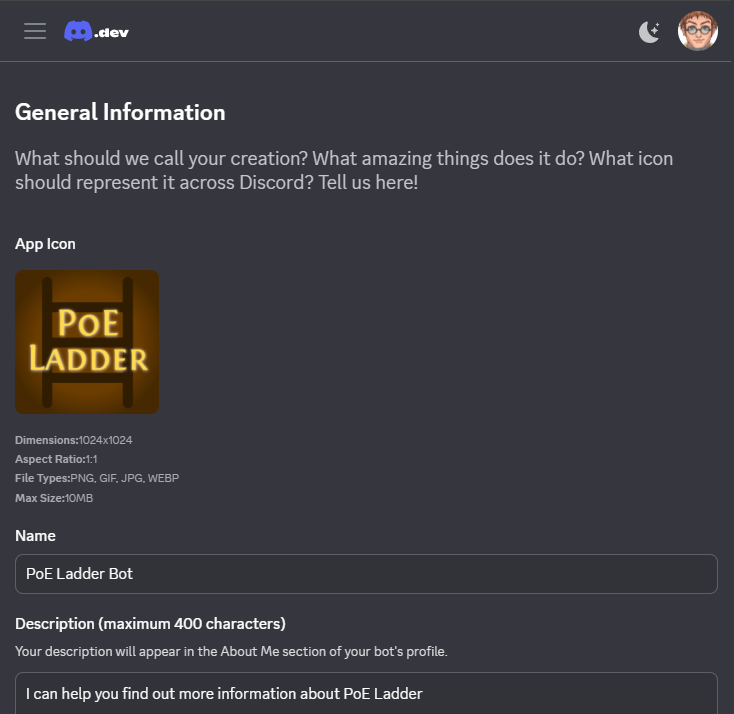
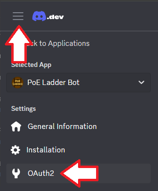
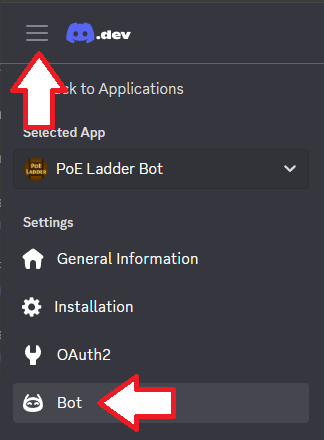
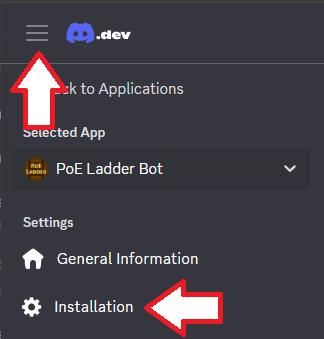
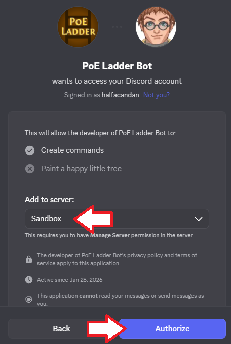
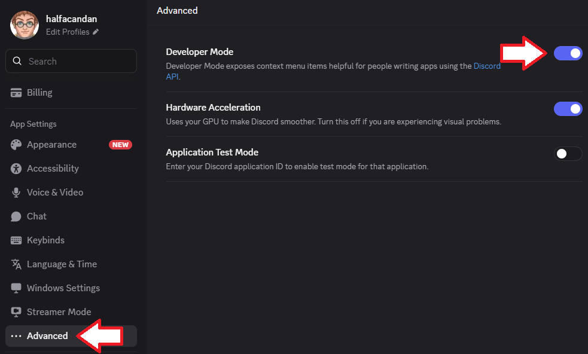
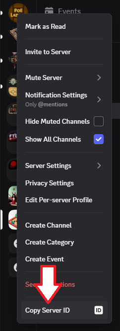
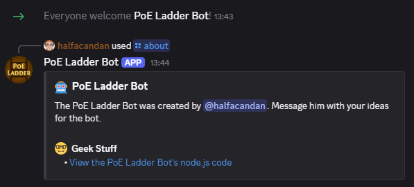

# PoE Ladder Bot

This project creates a Discord bot which interacts with PoE Ladder's bot api.

## Commands

| Command                  | Description                                   |
| ------------------------ | --------------------------------------------- |
| /about                   | Learn how to contribute to the PoE Ladder bot |
| /help                    | Get help with using the PoE Ladder bot        |
| /ladders                 | List the monitored PoE Ladder leagues         |
| /whois \[DiscordHandle\] | Lookup a Discord user's PoE Ladder Profile    |

## Local Development of the Bot

The bot runs in 

### Before You Begin

This guide uses Visual Studio Code but there are many alternatives. Install these pre-requisites before you begin:

1. [Download & Install Git](https://git-scm.com/downloads)
2. [Configure Git](https://git-scm.com/book/en/v2/Getting-Started-First-Time-Git-Setup)
3. [Download & Install Visual Studio Code](https://code.visualstudio.com/download)
4. [Download & Install Node](https://nodejs.org/en) - This includes npm (node package manager) which is used in the subsequent steps below
5. Open Visual Studio Code
6. Clone this Repository:
    1. The **Welcome** screen should include an option to **Clone Git Repository...**. Click this option
    2. Paste in this link then hit the **Enter** key: https://github.com/halfacandan/PoELadderBot.git
7. Open a terminal session in Visual Studio Code by opening the **Terminal** menu and selecting the **New Terminal** option
8. Install all required packages by running the following command in the terminal (it may take some time to download them all):
    
    ```bash
    npm install
    ```

### Setting up the Bot in Discord

Follow the steps outlined in this [Discord Bot Tutorial: Get your bot up and running in under 5 minutes](https://codeburst.io/discord-bot-tutorial-2020-a8a2e37e347c).

1. Go to the [Discord Developer Portal](https://discord.com/developers/applications)
2. Click the **New Application** button in the top-right corner of the screen

    

3. Give your bot a name, accept the T&Cs then click the **Create** button (as shown below)

    

4. Add a logo and a description for the application

    

5. Click the **Save Changes** button
6. Open the **OAuth2** menu

    

7. Copy the **Client ID** value and paste it into the **CLIENT_ID** value in the `.env.local` file in this repository
8. Click the **Reset Secret** button beneath the **Client Secret** heading to display a secret value
9. Copy the **Client Secret** value and paste it into the **PRIV_KEY** value in the `.env.local` file in this repository
10. Open the **Bot** menu

    

11. Click the **Reset Token** button
12. Copy the token value and paste it into the **BOT_TOKEN** value in the `.env.local` file in this repository
13. Scroll down the **Bot** page to the **Privileged Gateway Intents** section and enable the following options:

    - Message Content Intent
    - Server Members Intent

14. Click the **Save Changes** button
15. Open the **Installation** menu

    

16. Uncheck the **User Install** option under the **Installation Contexts** menu (leave **Guild Install** checked)
17. Scroll down to the **Install Link** and copy it.
18. Add "&permissions=2147593280&scope=bot%20applications.commands" to the end of the url e.g. 
    ```text
    https://discord.com/oauth2/authorize?client_id=123455667890&permissions=2147593280&scope=bot%20applications.commands
    ```
19. Open the revised url in a browser
20. Select the **Add to Server** option
21. Pick which server you'd like to add the bot to then click the **Authorize** button (as shown below):

    

**NOTE:** If you wish to replicate the permissions, you can use the **Bot Permissions** section on the **Bot** page and use the following:

- General Permissions:
  - View Channels
- Text Permissions: 
  - Send Messages
  - Manage Messages
  - Attach Files
  - Read Message History
  - Add reactions
  - Use Slash Commands

### Finding your Discord Server's Id

We need one last piece of configuration set up before we can run the bot:

1. Open the Discord desktop client
2. Click the cog icon next to your profile (in the bottom-left corner of the screen)

    

3. Scroll down the left-hand menu and select **Advanced** (as shown below)
4. Enable **Developer Mode**

    

5. You can now right-click on any of the servers which you have joined and use the **Copy Server ID** option

    

6. Copy the server id value and paste it into the **SERVER_ID** value in the `.env.local` file in this repository

### Running the Bot Locally

Once you have set up an application in Discord, you can host the bot on your computer by doing the following:

1. Open the Discord desktop client
2. Open the server which you have installed the bot on
3. Open Visual Studio Code
4. Open a terminal session in Visual Studio Code by opening the **Terminal** menu and selecting the **New Terminal** option
5. Run this command:

    ```bash
    npm run dev
    ```

6. You should see the message **PoE Ladder Bot is online** in the terminal
7. The bot will now show as online in your Discord Server
8. Test it with the slash command **/about**

    